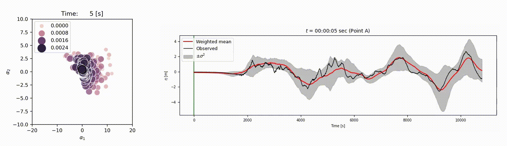

# sequential_tsunami_detection

Python codes for the real-time tsunami scenario detection.



- keywords
  - Bayesian update
  - Singular Value Docomposition (SVD), Proper Orthogonal Decomposition (POD)


```
┌── data
│   ├── obs_pnts.txt       Input file: Synthetic gauges used in the running
│   └── cases.txt          Input file: Scenarios used in the running
├── pgm
│   ├── run2.py            Main code
│   ├── ttsplit.py         Subroutine: Test/Training data splitting
│   ├── POD.py             Subroutine: Proper orthogonal decomposition
│   ├── psudo_inv.py       Subroutine: Pseudo inverse 
│   ├── bayesian_update.py Subroutine: Bayesian update
│   ├── beautyfun.py       Subroutine: Various functions for data handling
│   └── graphing.py        Subroutine: For graph making
└── res                    Output directory
```

## Environment
Tested and confirmed compatible environments
- CentOS(Linux) Ver.7
- python 3.8.7 (via pyenv)
- TORQUE resource manager


## Required python libraries

- numpy==1.21.2
- matplotlib==3.4.3
- scipy==1.7.1
- dask==2021.8.1
- seaborn==0.11.2


## References
For detail, please see the following paper.
Nomura, R., Fujita, S., Galbreath, J. M., Otake, Y., Moriguchi, S., Koshimura, S., et al. (2022). 
Sequential Bayesian update to detect the most likely tsunami scenario using observational wave sequences. 
Journal of Geophysical Research: Oceans, 127, e2021JC018324. https://doi.org/10.1029/2021JC018324

[](https://zenodo.org/badge/latestdoi/508964446)

